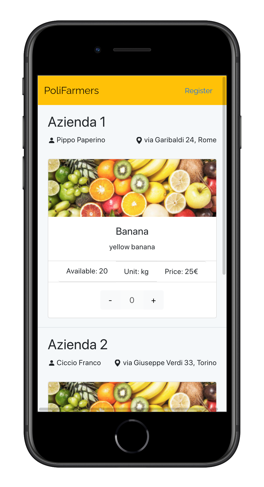
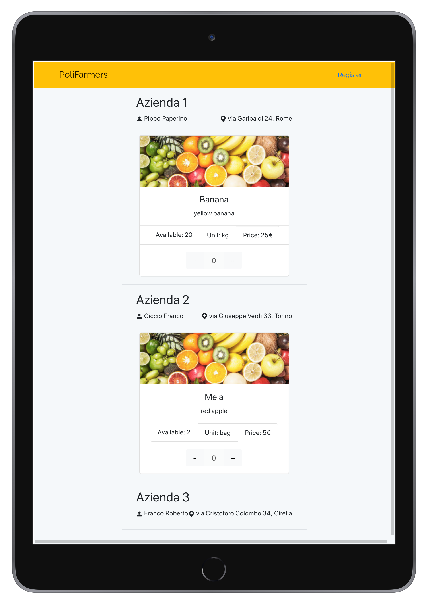

# Solidarity Purchasing Group

## React Client Application Routes

- Route `/`: homepage page for the website

## API Server

- GET `/api/users`
  - **description**: get all users
  
  - **request parameters**: *none*
  
  - **response**: `200 OK` (success) or `500 Internal Server Error` (generic error)
  
  - **response body content**: array of objects, each describing a user
    
    ```json5
    [{
        "Name": "Teddy",
        "Surname": "Agnez",
        "UserID": "aa8eb4f9-4822-4772-b7ad-128a8710ac07",
        "Email": "mario.rossi@gmail.com",
        "Phoneno": "9938893232",
        "Address": "Via Bolivia 1",
        "State": "fi",
        "Zipcode": "45678"
    },
    ...
    ]
    ```
  
- GET `/api/farmers`
  - **description**: get all farmers
  
  - **request parameters**: *none*
  
  - **response**: `200 OK` (success) or `500 Internal Server Error` (generic error)
  
  - **response body content**: array of objects, each describing a farmer
    
    ```json5
    [{
        "Name": "Pippo",
        "Surname": "Paperino",
        "Company": "Azienda 1",
        "FarmerID": "JJeuoVa8fpl4wHGLK8FO",
        "Email": "pippo@hotmail.com",
        "Phoneno": "4125364789",
        "Address": "via Garibaldi 24",
        "State": "Rome",
        "Zipcode": "01578"
    },
    ...
    ]
    ```
  
- GET `/api/productByFarmer`
    - **description**: get all products by farmers

    - **request parameters**: *none*

    - **response**: `200 OK` (success), `404 Not Found ` (empty table in Firebase) or `500 Internal Server Error` (generic error)

    - **response body content**: array of objects, each describing a product by a farmer

      ```json5
      
      [{
          "FarmerID": "JJeuoVa8fpl4wHGLK8FO",
          "Name": "Pippo",
          "Surname": "Paperino",
          "Company": "Azienda 1",
          "Email": "pippo@hotmail.com",
          "Phoneno": "4125364789",
          "Address": "via Garibaldi ",
          "State": "Rome",
          "Zipcode": "01578",
          "ProductID": "MUQoYddzRZSmHQliVfkA",
          "NameProduct": "Banana",
          "Description": "yellow banana",
          "ImageID": "0",
          "Quantity": "20",
          "UnitOfMeasurement": "kg",
          "Price": "25"
      },
      ...
      ]
      ```
      
      Error response `404`:
      
      ```json
      {
          "error": "No matching documents."
      }
      ```
    
- POST `/api/register`
  
  - **description**: insert a new user into the database
  
  - **request parameters**: *none*
  
  - **request body**: object describing the new user
  
      ```json5
      {
          "name": "Teddy",
          "lastName": "Agnez",
          "email": "mario.rossi@gmail.com",
          "address": "Via Bolivia",
          "phone": "9938893232",
          "city": "fi",
          "password": "qwerty"
      }
      ```
      
  - **response**: `201 Created` (success), `400 Bad Request` (error in passed parameters) or `500 Internal Server Error` (generic error)
  
  - **response body content**: *none* in case of success, error object in case of error
  
      ```json5
      {
          "info": "The server cannot process the request",
          "errors": [
              {
                  "param": "name",
                  "error": "Invalid value"
              },
              ...
          ]
      }
      ```
  
      
  
## Database Tables
- Table `Farmer` is used to store farmer information and it contains the following fields and data:

   | ID                   | Name   | Surname  | Company   | Email              | Phoneno    | Address                   | State   | Zipcode |
   | -------------------- | ------ | -------- | --------- | ------------------ | ---------- | ------------------------- | ------- | ------- |
   | JJeuoVa8fpl4wHGLK8FO | Pippo  | Paperino | Azienda 1 | pippo@hotmail.com  | 4125364789 | via Garibaldi 24          | Rome    | 01578   |
   | lMeqm2RmkDtBURW4AeUy | Ciccio | Franco   | Azienda 2 | cicio@hotmail.com  | 9874515888 | via Giuseppe Verdi 33     | Torino  | 10138   |
   | zJbZkZDUPf9q91ZgS8ew | Franco | Roberto  | Azienda 3 | alessio@hotmail.it | 3400987654 | via Cristoforo Colombo 34 | Cirella | 87023   |

-  Table `Product` is used to store a product and it contains the following fields and data:
   
   | ID                   | Name       | Description    | ImageID |
   | -------------------- | ---------- | -------------- | ------- |
   | MUQoYddzRZSmHQliVfkA | Banana     | yellow banana  | 0       |
   | jppCV62HMquGu2JP01Eu | Mela       | red apple      | 1       |
   | yO3IMNEUlAWnllA2Hxyf | Strawberry | red strawberry | 2       |
   
-  Table `Products by Farmers` is used to store the products sold by each farmer and it contains the following fields and data:
   
   | ID                   | FarmerID             | ProductID            | Quantity | Unitofmeasurement | Price |
   | -------------------- | -------------------- | -------------------- | -------- | ----------------- | ----- |
   | S0F5R4D1xF16w5mJmkHM | JJeuoVa8fpl4wHGLK8FO | MUQoYddzRZSmHQliVfkA | 20       | kg                | 25    |
   | jSgQy72Db130XsqiB3GI | lMeqm2RmkDtBURW4AeUy | jppCV62HMquGu2JP01Eu | 2        | bag               | 5     |

- Table `User` is used to store user information and it contains the following fields and data:

   | ID                                   | name       | surname | email                     | address                     | phone      | city | password | zipcode |
   | ------------------------------------ | ---------- | ------- | ------------------------- | --------------------------- | ---------- | ---- | -------- | ------- |
   | 11a9f103-d5fc-4612-bd38-0bf4a792486b | Policarpio | Perez   | poliperez@mail.com        | Via Capo del Mondo 1        | 3527163456 | vt   | 123456   | 12345   |
   | 2d082c0e-9c43-49fc-bb65-cf8bae607f05 | willmar    | willmar | gillmar@protonmail.com    | Via Virtuale 1              | 3661375553 | ge   | q        | 10546   |
   | 37929302-bd1d-4364-99dc-b53ae22b38aa | maria      | Rossa   | mariarossa@gmail.com      | via monginevro 21           | 9938893435 | ca   | qwerty   | 12876   |
   | 37eaddec-f830-4bc3-a661-649a1867fbad | willmar    | rengifo | willmar.rengifo@gmail.com | Corso Duca degli Abruzzi 24 | 3661375554 | br   | 1234     | 90876   |
   | aa8eb4f9-4822-4772-b7ad-128a8710ac07 | Teddy      | Agnez   | mario.rossi@gmail.com     | Via Bolivia 1               | 9938893232 | fi   | qwerty   | 45678   |
   
- Table `Order` is used to store order information and it contains the following fields and data:

   | ID                   | ClientID                             | ProductinorderID     | Timestamp                          |
   | -------------------- | ------------------------------------ | -------------------- | ---------------------------------- |
   | LVdyH4bpmNqNPn2lSeQf | aa8eb4f9-4822-4772-b7ad-128a8710ac07 | A1NRABTj19mRKumOD2Sv | 10 November 2021 at 00:00:00 UTC+1 |

   

- Table `ProductInOrder` is used to store information about products in each order and it contains the following fields and data:

   | ID                   | OrderID              | ProductName | ProductbyfarmerID    | Quantity |
   | -------------------- | -------------------- | ----------- | -------------------- | -------- |
   | A1NRABTj19mRKumOD2Sv | LVdyH4bpmNqNPn2lSeQf | Banana      | S0F5R4D1xF16w5mJmkHM | 10       |

   

## Main React Components

- `Placeholder` (in `Placeholder.js`): component to generate a placeholder

## Screenshots

</img>
</img>
<br/>
</img>
