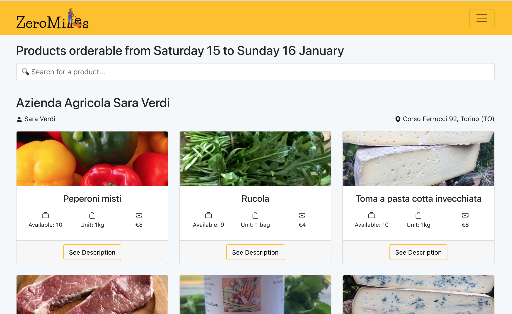

# Solidarity Purchasing Group

## React Client Application Routes

- Route `/`: homepage page for the website

## API Server

- GET `/api/users`
  - **Authenticated** - Unauthorized by a Client

  - **description**: get all users
  
  - **request parameters**: *none*
  
  - **response**: `200 OK` (success) or `500 Internal Server Error` (generic error)
  
  - **response body content**: array of objects, each describing a user
    
    ```json5
    [{
        "Name": "Teddy",
        "Surname": "Agnez",
        "UserID": "aa8eb4f9-4822-4772-b7ad-128a8710ac07",
        "Email": "mario.rossi@gmail.com",
        "Phoneno": "9938893232",
        "Address": "Via Bolivia 1",
        "State": "fi",
        "Zipcode": "45678"
    },
    ...
    ]
    ```

- GET `/api/userinfo`
    - **Authenticated**

    - **description**: get informations about a single user (the authenticated one)

- GET `/api/clientorders/:date`
    - **Authenticated**

    - **description**: get all orders by a user (the authenticated one)

- GET `/api/farmers`
  - **Authenticated** 

  - **description**: get all farmers
  
  - **request parameters**: *none*
  
  - **response**: `200 OK` (success) or `500 Internal Server Error` (generic error)
  
  - **response body content**: array of objects, each describing a farmer
    
    ```json5
    [{
        "Name": "Pippo",
        "Surname": "Paperino",
        "Company": "Azienda 1",
        "FarmerID": "JJeuoVa8fpl4wHGLK8FO",
        "Email": "pippo@hotmail.com",
        "Phoneno": "4125364789",
        "Address": "via Garibaldi 24",
        "State": "Rome",
        "Zipcode": "01578"
    },
    ...
    ]
    ```

- GET `/api/products`
    - **Authenticated**

    - **description**: get all products

- GET `/api/allProductsByFarmers`
    - **Authenticated**

    - **description**: get all products by all farmers

    - **request parameters**: *none*

    - **response**: `200 OK` (success), `404 Not Found ` (empty table in Firebase) or `500 Internal Server Error` (generic error)

    - **response body content**: array of objects, each describing a product by a farmer

      ```json5
      
      [{
          "FarmerID": "JJeuoVa8fpl4wHGLK8FO",
          "Name": "Pippo",
          "Surname": "Paperino",
          "Company": "Azienda 1",
          "Email": "pippo@hotmail.com",
          "Phoneno": "4125364789",
          "Address": "via Garibaldi ",
          "State": "Rome",
          "Zipcode": "01578",
          "ProductID": "MUQoYddzRZSmHQliVfkA",
          "NameProduct": "Banana",
          "Description": "yellow banana",
          "ImageID": "0",
          "Quantity": "20",
          "UnitOfMeasurement": "kg",
          "Price": "25"
      },
      ...
      ]
      ```
      
      Error response `404`:
      
      ```json
      {
          "error": "No matching documents."
      }
      ```
    
- GET `/api/productsByFarmer/:date`
    - **Authenticated** - Authorized only by a Farmer

    - **description**: get all products by only one farmer (the authenticated one)

- GET `/api/orders/:date`
    - **Authenticated** - Unauthorized by a Client

    - **description**: get all orders of all users

- GET `/api/cancelledorders/:date`
    - **Authenticated** - Unauthorized by a Client

    - **description**: get all cancelled orders of this week of all users

- GET `/api/monthlyNotRetiredOrders/:date`
    - **Authenticated** - Unauthorized by a Client

    - **description**: get not retired orders (same month)

- GET `/api/weeklyNotRetiredOrders/:date`
    - **Authenticated** - Unauthorized by a Client

    - **description**: get not retired orders (previous week)

- GET `/api/notRetiredOrder`
    - **Authenticated** 

    - **description**: 

- GET `/api/confirmationProduct/:date`
    - **Authenticated** - Unauthorized by a Client

    - **description**: get products by one farmer(the authenticated one) ordered in this week

- POST `/api/order`
    - **Authenticated** 

    - **description**: insert a new order into the database

- POST `/api/modifyDelivery`
    - **Authenticated** 

    - **description**: update delivery informations

- POST `/api/setPickUpTime`
    - **Authenticated** 

    - **description**: update pickup informations   

- POST `/api/register`
  - **Not Authenticated** 
  
  - **description**: insert a new user into the database
  
  - **request parameters**: *none*
  
  - **request body**: object describing the new user
  
      ```json5
      {
         {
    "name": "Luca",
    "surname": "Magurno",
    "email": "lucamagurno@gmail.com",
    "address": "Via riviere 93",
    "phone" : "3456879098",
    "city" : "Torino",
    "password" : "sium",
    "zipcode" : "87023",
    "stateCaps" : "TO"

    }
      ```
      
  - **response**: `201 Created` (success), `400 Bad Request` (error in passed parameters) or `500 Internal Server Error` (generic error)
  
  - **response body content**: *none* in case of success, error object in case of error
  
      ```json5
      {
          "info": "The server cannot process the request",
          "errors": [
              {
                  "param": "name",
                  "error": "Invalid value"
              },
              ...
          ]
      }
      ```
 


- POST `/api/farmerRegister`
  - **Authenticated** 
  
  - **description**: insert a new user into the database
  
  - **request parameters**: *none*
  
  - **request body**: object describing the new user
  
      ```json5
      {
         {
    "name": "Luca",
    "surname": "Magurno",
    "email": "lucamagurno@gmail.com",
    "address": "Via riviere 93",
    "company" : "Le riviere",
    "phone" : "3456879098",
    "city" : "Torino",
    "password" : "sium",
    "zipcode" : "87023",
    "stateCaps" : "TO"

    }
      ```
      
  - **response**: `201 Created` (success), `400 Bad Request` (error in passed parameters) or `500 Internal Server Error` (generic error)
  
  - **response body content**: *none* in case of success, error object in case of error
  
      ```json5
      {
          "info": "The server cannot process the request",
          "errors": [
              {
                  "param": "name",
                  "error": "Invalid value"
              },
              ...
          ]
      }
      ```
 
- POST `/api/timeMachine`
    - **Authenticated** 

    - **description**: activate time machine and trigger events (orders processing and telegram notification)

- POST `/api/modifyorder`
    - **Authenticated** 

    - **description**: Modify satus of an order manually by employee

- POST `/api/modifywallet`
    - **Authenticated** 

    - **description**: Modify a client wallet 

- POST `/api/checkClient`
    - **Authenticated** 

    - **description**: Return money of open order by an autenticated client

- POST `/api/addProduct`
    - **Authenticated** - Authorized only by a Farmer

    - **description**: add a new product (by farmer) in the database

- POST `/api/deleteProduct`
    - **Authenticated** - Authorized only by a Farmer

    - **description**: delete a product (by farmer) in the database

- POST `/api/confirmation`
    - **Authenticated** - Unauthorized by a Client

    - **description**: Confirmation of product by a farmer

- POST `/api/newproduct`
    - **Authenticated** -

    - **description**: store a new product with related image into the server

## Database Tables
- Table `Farmer` is used to store farmer information and it contains the following fields and data:

   | ID                   | Name   | Surname  | Company   | Email              | Phoneno    | Address                   | State   | Zipcode |
   | -------------------- | ------ | -------- | --------- | ------------------ | ---------- | ------------------------- | ------- | ------- |
   | JJeuoVa8fpl4wHGLK8FO | Pippo  | Paperino | Azienda 1 | pippo@hotmail.com  | 4125364789 | via Garibaldi 24          | Rome    | 01578   |
   | lMeqm2RmkDtBURW4AeUy | Ciccio | Franco   | Azienda 2 | cicio@hotmail.com  | 9874515888 | via Giuseppe Verdi 33     | Torino  | 10138   |
   | zJbZkZDUPf9q91ZgS8ew | Franco | Roberto  | Azienda 3 | alessio@hotmail.it | 3400987654 | via Cristoforo Colombo 34 | Cirella | 87023   |

-  Table `Product` is used to store a product and it contains the following fields and data:
   
   | ID                   | Name       | Description    | ImageID |
   | -------------------- | ---------- | -------------- | ------- |
   | MUQoYddzRZSmHQliVfkA | Banana     | yellow banana  | 0       |
   | jppCV62HMquGu2JP01Eu | Mela       | red apple      | 1       |
   | yO3IMNEUlAWnllA2Hxyf | Strawberry | red strawberry | 2       |
   
-  Table `Products by Farmers` is used to store the products sold by each farmer and it contains the following fields and data:
   
   | ID                   | FarmerID             | ProductID            | Quantity | Unitofmeasurement | Price |
   | -------------------- | -------------------- | -------------------- | -------- | ----------------- | ----- |
   | S0F5R4D1xF16w5mJmkHM | JJeuoVa8fpl4wHGLK8FO | MUQoYddzRZSmHQliVfkA | 20       | kg                | 25    |
   | jSgQy72Db130XsqiB3GI | lMeqm2RmkDtBURW4AeUy | jppCV62HMquGu2JP01Eu | 2        | bag               | 5     |

- Table `User` is used to store user information and it contains the following fields and data:

   | ID                                   | Name      | Surname    | Email                       | Address                     | Phoneno    | City    | State | Zipcode | Password     |
   | ------------------------------------ | --------- | ---------- | --------------------------- | --------------------------- | ---------- | ------- | ----- | ------- | ------------ |
   | 1BM0UzyOXSs1MqSUDuBs                 | Miriam  | Leone   | miriam.client@gmail.com | Via Volvera 14       | 3248967546 | Turin   | TO    | 10141   | supersecret2 |
   | 4uiJeIxtoneCS9qJPksH                 | Eva       | Jobs       | eva.jobs@apple.com          | Via Nizza 40                | 2907654356 | Turin   | TO    | 10129   | supersecret3 |

   
- Table `Order` is used to store order information and it contains the following fields and data:

   | ID                   | ClientID                             | ProductinorderID     | Timestamp                          |
   | -------------------- | ------------------------------------ | -------------------- | ---------------------------------- |
   | LVdyH4bpmNqNPn2lSeQf | aa8eb4f9-4822-4772-b7ad-128a8710ac07 | A1NRABTj19mRKumOD2Sv | 10 November 2021 at 00:00:00 UTC+1 |

   

- Table `ProductInOrder` is used to store information about products in each order and it contains the following fields and data:

   | ID                   | OrderID              | ProductName | ProductbyfarmerID    | Quantity |
   | -------------------- | -------------------- | ----------- | -------------------- | -------- |
   | A1NRABTj19mRKumOD2Sv | LVdyH4bpmNqNPn2lSeQf | Banana      | S0F5R4D1xF16w5mJmkHM | 10       |

   

## Users that can be used to try the application

   | Role                 | Username             | Password    |
   | -------------------- | -------------------- | ----------- | 
   | Farmer | marco.farmer@gmail.com | supersecret2      | 
   | Manager | michele.manager@zeromiles.it | supersecret4      | 
   | Employee | mauro.employee@gmail.com | password0      | 
   | User | miriam.client@gmail.com | supersecret2      | 
   | User with 5 not retired orders | matteo.notretired@gmail.com | supersecret2      | 

## Screenshots

</img>

